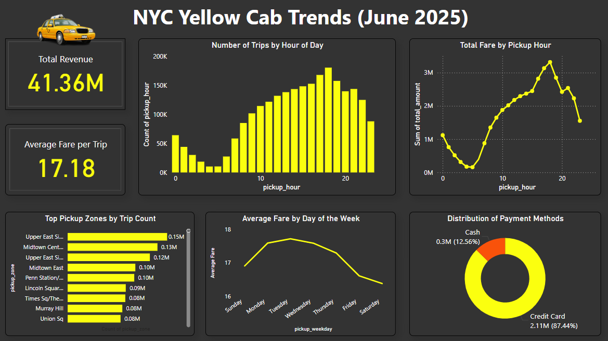

# NYC Yellow Taxi Trip Analysis (June 2025)

This project analyzes the NYC Yellow Taxi trip data for June 2025, sourced from the [NYC Taxi & Limousine Commission (TLC)](https://www.nyc.gov/site/tlc/about/tlc-trip-record-data.page).

## Project Overview
- Total records analyzed: **~2 million trips**
- Tools used: **Python (Pandas, Matplotlib,Seaborn), Power BI**
- Dataset size: **Originally ~4M, filtered & cleaned to 2M records**
- Dashboard created using **Power BI** and published publicly

## Folder Structure
- `data/`: Contains the cleaned dataset in Parquet format.
- `notebooks/`: Jupyter notebook with data cleaning and analysis.
- `dashboard/`: Screenshot and link to interactive dashboard.

## Dashboard
View the interactive Power BI Dashboard here:  
🔗 [Click to View Dashboard](https://app.powerbi.com/view?r=eyJrIjoiYzkyZGMxYzMtMjE2Zi00YWFlLWE4NDAtNGI2ZjVjMTRkMGQzIiwidCI6ImRhYTU5MmNhLWRlN2ItNGM1NC04ODM2LTkxYTY2OTBmZTE5NyJ9)

## Technologies Used
- Python (Pandas, Numpy, Matplotlib)
- Power BI for interactive data visualization
- Jupyter Notebook for EDA and preprocessing

## Highlights
- Worked with large real-world data (~4 million records)
- Data cleaning, feature engineering, and visualization
- Professional-grade dashboard designed with yellow–black theme for NYC

## Dataset Source
[NYC TLC Trip Record Data – June 2025](https://www.nyc.gov/site/tlc/about/tlc-trip-record-data.page)

## Dashboard

🔗 [**Click to View Interactive Power BI Dashboard**](https://app.powerbi.com/view?r=eyJrIjoiYzkyZGMxYzMtMjE2Zi00YWFlLWE4NDAtNGI2ZjVjMTRkMGQzIiwidCI6ImRhYTU5MmNhLWRlN2ItNGM1NC04ODM2LTkxYTY2OTBmZTE5NyJ9)

---
